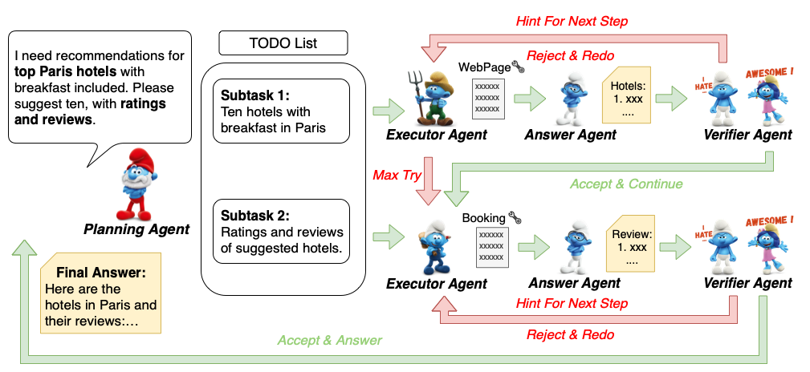

<h1>[url=https://yoursmiles.org/h-smurf.php][img]https://yoursmiles.org/hsmile/smurf/h3602.gif[/img][/url]Smurfs</h1>
<h3>Leveraging Multiple Proficiency Agents with Context-Efficiency
for Tool Planning<h3>

## What's New
+  [2024.05.23] We release Smurfs, a multi-agent framework that gives LLM access to external tools to efficiently
solve complex tasks.
   + The code and datasets are available at [Smurfs](#).
   + The paper is available at [Smurfs: Leveraging Multiple Proficiency Agents with Context-Efficiency
for Tool Planning](http://arxiv.org/abs/2405.05955).

✨Here is an overview of the Smurfs framework.

 

 

✨✨Features:

## Data

## Inference

## Evaluation

